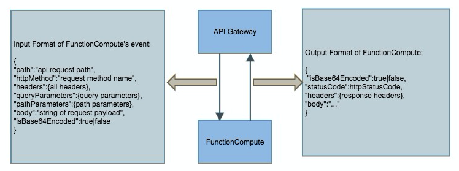

## 阿里云 函数计算([Java](https://help.aliyun.com/document_detail/58887.html?spm=5176.doc52699.6.592.5Bmqux))
> 记录一下碰到的一些问题

1. 上传代码(Java) `mkf encrypt -h EncryptFC::handleRequest --runtime java8 -d ./target/classes/`
   * 更新函数计算命令 `upf ffmpeg-fc -h vlink.VideoLink::handleRequest --runtime java8 -d ./classes/`
   * -h 参数:EncryptFC:类名, 需加上包名, e.g., `com.icc.EncryptFC`, handleRequest:接口名称
   * -d 后面的参数路径为编译后的classes路径,尝试过上传jar包,但是总是报异常
   * _需要将第三方依赖包放至`./target/classes/`目录下面_

2. 如果直接通过[fcli](https://help.aliyun.com/document_detail/52995.html?spm=5176.doc58887.6.601.flN3zH)调用,则返回信息无格式要求,
   如果作为API网关服务调用则需遵循固定的[格式](https://help.aliyun.com/document_detail/54788.html),入参也有固定的格式,可以从InputStream中获取并且转换为JSON格式
   通过fcli 调用:
   ```
   invk encrypt -s {\"body\":\"\",\"isBase64Encoded\":false}
   ```
   


## 参考
[实践篇：搭建无服务器应用--函数计算+API网关+云市场（提供手机号归属地查询服务）](https://help.aliyun.com/document_detail/54788.html)


